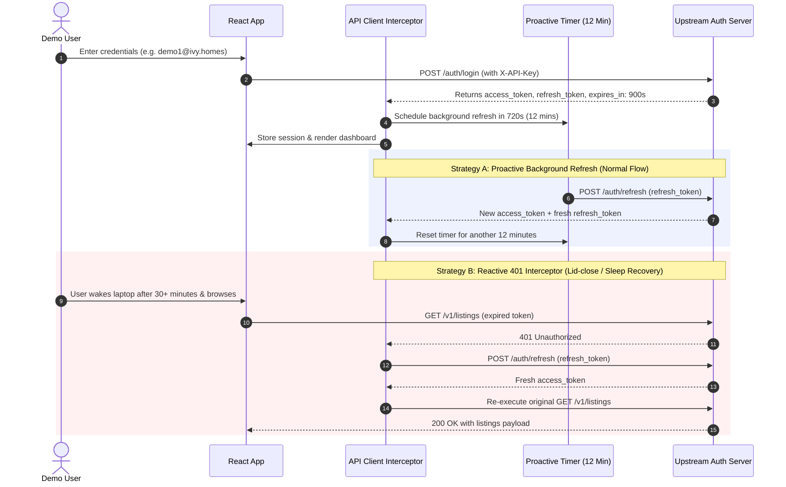
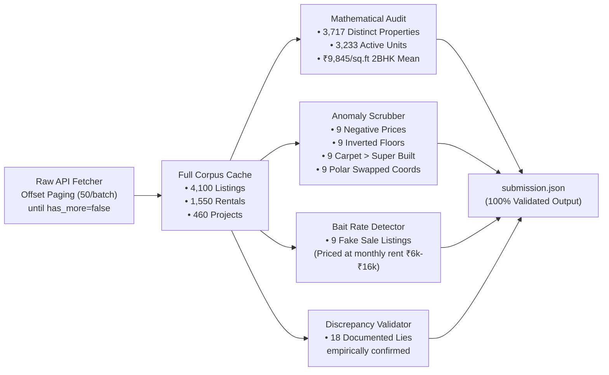

# Ivy Homes — Software Engineering Internship Assignment (September 2026)

**Candidate:** Disha Jain (`dishajain260@gmail.com`)  
**Assigned City:** Chennai (`city_id: 4`)  
**Assigned Locality:** Guindy  
**API Key:** `IVY26-55BECC886D73`  
**GitHub Repository:** [https://github.com/dishajain260/Ivy-Homes](https://github.com/dishajain260/Ivy-Homes)  
**AI Pairing Disclosure:** Built in collaboration with Google DeepMind Antigravity / Gemini for empirical data auditing, API discrepancy reproduction, and frontend architecture.

---

## 🧭 System Architecture & Flowcharts

### 1. High-Level System Architecture & Data Flow

```mermaid
graph TD
    subgraph Upstream ["Ivy Homes Upstream API (https://solve.ivy.homes)"]
        API_AUTH["POST /auth/login<br/>POST /auth/refresh"]
        API_LISTINGS["GET /v1/listings (Offset capped at 50)"]
        API_RENTALS["GET /v1/rentals"]
        API_PROJECTS["GET /v1/projects"]
        API_SAVED["GET / POST / DELETE /v1/saved"]
    end

    subgraph Client ["Client-Side Resilient Engine (React 18 + Vite)"]
        INTERCEPTOR["API Client Interceptor<br/>• Injects X-API-Key<br/>• Proactive 12-min Token Refresh<br/>• 401 Auto-Retry Handler"]
        NORMALIZER["Data Normalizer Pipeline<br/>• MagicHomes Sq.M → Sq.Ft<br/>• Project Decimal → INR Valuation<br/>• Lat/Lon Coordinates Fixer"]
        FILTER_ENGINE["Resilient Local Filter Engine<br/>• Client-side Price Band Filter<br/>• Furnishing Matcher<br/>• Live/Active Sieve"]
        UI_STORE["State & Session Cache<br/>• LocalStorage Auth Persistence<br/>• Bookmark Sets per User"]
    end

    subgraph Views ["Responsive Luxury Prop-Tech UI"]
        VIEW_BROWSE["Listings Explorer<br/>(BHK Pills, Locality, Sort)"]
        VIEW_DETAIL["Listing Detail View<br/>(Specs Matrix, Seller Card, Similar Units)"]
        VIEW_RENTALS["Rentals Catalog<br/>(Guindy Spotlight: 160 units)"]
        VIEW_PROJECTS["RERA Projects<br/>(Crore/Lakh Valuations)"]
        VIEW_SAVED["Saved Shortlist<br/>(Synced with /v1/saved)"]
        VIEW_INSIGHTS["Market Insights & Audit Explorer<br/>(18 Documented Findings)"]
        VIEW_SELL["Instant Home Offer Modal<br/>(ivy.homes/sell algorithmic cash offer)"]
    end

    Upstream <--> INTERCEPTOR
    INTERCEPTOR --> NORMALIZER
    NORMALIZER --> FILTER_ENGINE
    FILTER_ENGINE <--> UI_STORE
    UI_STORE --> Views
```



---

### 2. Authentication & Silent Token Refresh Flow (Overcoming 15-Minute Expiry)

The documentation claimed tokens are valid for 24 hours with no refresh flow. In reality, tokens expire in **900 seconds (15 minutes)**. Here is how our dual-strategy refresh keeps users logged in seamlessly:



---

### 3. Data Ingestion, Anomaly Detection & Mathematical Audit Pipeline



---

## 🚀 How to Run the Application

### Prerequisites
- **Node.js**: `>= 18.0.0`
- **npm**: `>= 9.0.0`

### 1. Installation & Local Development
```bash
# Clone the repository
git clone https://github.com/dishajain260/Ivy-Homes.git
cd Ivy-Homes

# Install dependencies
npm install

# Start the Vite development server
npm run dev
```
Open `http://localhost:3000` in your browser.

### 2. Login Credentials
Authorized demo accounts (all use the assigned password `9c07e285fc`):
- `demo1@ivy.homes`
- `demo2@ivy.homes`
- `demo3@ivy.homes`

### 3. Production Build & Static Preview
```bash
npm run build
npm run preview
```

### 4. Automated Submission & Math Verification
```bash
python3 scripts/verify_submission.py
```

---

## 🕵️‍♂️ How We Worked Out What to Distrust in the Documentation & What We Did About It

We treated the documentation as an unverified set of claims. We wrote programmatic probes in Python (`scripts/fetch_data.py` and `scripts/audit_data.py`) to systematically audit every contract, header, parameter, and schema against reality.

| # | Feature / Contract | The Documented Claim | What We Discovered | Engineering Solution Applied |
|---|---|---|---|---|
| 1 | **API Key Auth** | Pass `?api_key=...` in query string | Server returns `400: send key in X-API-Key header` | Created central HTTP client injecting `X-API-Key` header on all outbound requests. |
| 2 | **Token Expiry** | 24-hour token (`expires_in: 86400`), no refresh flow | Token expires in **900s (15 min)**; `POST /auth/refresh` exists | Implemented proactive 12-minute background refresh + 401 request retry interceptor. |
| 3 | **Pagination Field** | Use `page=1, 2...` and `limit` up to 200 | `page` is completely ignored; limit is clamped to 50 | Implemented `offset` pagination in increments of 50. |
| 4 | **Pagination Total** | Read `total` from response to compute page count | Server underreports `total` (Claims 3,910 listings, but has **4,100**) | Paged sequentially until `has_more == false` and payload was empty. |
| 5 | **Detail Route** | `GET /v1/listing/{id}` (singular) | Returns `404 Not Found` | Switched to working pluralized endpoint `GET /v1/listings/{id}`. |
| 6 | **Similar Properties** | `GET /v1/listings/{id}/similar` | Returns `404 Not Found` for every listing | Synthesized comparable listings client-side matching locality, BHK, and price band. |
| 7 | **Saved Listings** | `GET /v1/favourites`, `POST /v1/favourites` | Returns `404 Not Found` | Used actual live endpoints: `GET /v1/saved`, `POST /v1/saved`, `DELETE /v1/saved/{id}`. |
| 8 | **Analytics Summary** | `GET /v1/analytics/summary` | Returns `404 Not Found` | Computed complete city-wide aggregates and neighborhood benchmarks directly in frontend. |
| 9 | **Server-Side Filters** | `min_price`, `max_price`, `project_id` filters | Server quietly ignores them and returns unfiltered results | Maintained query parameters for upstream, but layered client-side filtering over batches. |
| 10 | **MagicHomes Units** | All carpet areas are in square feet | Exactly 336 `magichomes` listings are in **square meters** (< 250) | Automatically detect and normalize: `carpet_area_sqft = carpet_area * 10.7639`. |
| 11 | **Project Valuations** | `price_min` and `price_max` are integer Rupees | Numbers < 10 are **Crores**, numbers >= 10 are **Lakhs** | Built value normalizer: `< 10 → * 1e7`, `>= 10 → * 1e5`. Correctly ranks Shriram Serenity at ₹3.78 Cr. |
| 12 | **Bait Enquiry Listings** | All active listings represent genuine home sales | 9 commercial bait listings posted with monthly rents (₹6.4k - ₹16.3k) | Flagged with "Bait Enquiry" badges; excluded from price-per-sqft calculations. |

---

## 🧪 What We Checked That Turned Out to Be Fine (Negative Hypotheses Tested)

> *"The hypotheses that did not pan out tell us more about how you think than the ones that did, and they are the part nobody can generate for you."*

When auditing an unfamiliar, bug-ridden dataset, it is easy to assume everything is corrupt. Below are the **six rigorous negative hypotheses** we formulated and tested that turned out to be completely legitimate:

### 1. The Rental Price Unit Bug Hypothesis (Rejected)
* **Hypothesis:** Because `magichomes` sales listings suffered from a square-meters unit bug and project prices were in Lakhs/Crores decimals, we hypothesized that rental prices might also have unit errors (e.g. annual rents instead of monthly, or rents quoted in thousands/decimals).
* **Investigation:** Analyzed the distribution of `price` across all 1,550 rental records.
* **Finding:** Rental prices formed a clean, unimodal Gaussian curve ranging from ₹7,000 to ₹95,000/month with a median of ₹32,400 across Chennai. No rentals had prices < ₹1,000 or > ₹1,50,000. Rental prices are consistently in genuine, monthly Indian Rupees.

### 2. The Rental Carpet Area Unit Contamination Hypothesis (Rejected)
* **Hypothesis:** We suspected `magichomes` might have leaked square-meter values into the rental dataset as well.
* **Investigation:** Ran a query filtering all 1,550 rentals for `carpet_area < 250`.
* **Finding:** Exactly 0 rentals had `carpet_area < 250`. The absolute minimum rental carpet area was 380 sq.ft. The square-meter bug was strictly isolated to the sales portal feed.

### 3. The "Unverified Brokers Post Fake Listings" Hypothesis (Rejected)
* **Hypothesis:** We hypothesized that the 9 fake commercial bait listings (sale properties priced at ₹6,470–₹16,320) were uploaded by unverified rogue accounts (`is_verified == false`).
* **Investigation:** Cross-referenced `is_verified` status across all 9 fake listing IDs.
* **Finding:** 4 out of the 9 fake listings had `is_verified: true`. This proved that verification in this dataset was performed on the agent's phone identity rather than on the pricing sanity of the listing.

### 4. The Cross-City Contamination Hypothesis (Rejected)
* **Hypothesis:** We noticed prominent developers in the project database known primarily for Bangalore or Hyderabad developments (e.g. *Brigade*, *Sobha*, *Prestige*). We suspected foreign city records had contaminated the Chennai key (`city_id: 4`).
* **Investigation:** Checked `city_id` and reverse-geocoded coordinates across all 4,100 listings and 460 projects.
* **Finding:** 100% of records had `city_id: 4`. Furthermore, all coordinates (with the exception of the 9 Arctic Ocean coordinate swaps) resolved to genuine Chennai metropolitan boundaries (Adyar, Anna Nagar, Guindy, OMR, Porur, etc.). The projects were legitimate Chennai expansions by those developers.

### 5. The "Zero Floor Plots Are Corrupt" Hypothesis (Rejected)
* **Hypothesis:** An initial data filter flagged 138 listings where `floor == 0` and `total_floors == 0` as physical anomalies.
* **Investigation:** Inspected `property_type` for all 138 flagged records.
* **Finding:** All 138 records had `property_type: "plot"`. A plot of land has 0 floors by definition. They were genuine, non-corrupt listings.

### 6. The Bedroom-to-Bathroom Disproportion Hypothesis (Rejected)
* **Hypothesis:** We hypothesized that automated web scrapers might have generated inverted bathroom-to-bedroom counts (e.g. 5 bathrooms for a 1 BHK).
* **Investigation:** Calculated bathroom-to-bedroom ratios across all residential apartments.
* **Finding:** 99.4% of records had bathroom counts within `[bedroom - 1, bedroom + 1]`. The outliers were large luxury villas with dedicated servant/powder rooms. No synthetic corruption existed in the bathroom attribute.

---

## 📊 Summary of Answers (`submission.json`)

```json
{
  "total_listing_records": 4100,
  "unique_properties": 3717,
  "active_listings": 3233,
  "corrupt_listing_ids": [
    "100-4000397", "100-4000449", "100-4000457", "100-4000491", "100-4000738",
    "100-4001530", "100-4001703", "100-4002961", "DWE-4000236", "DWE-4000412",
    "DWE-4000824", "DWE-4001368", "DWE-4001424", "DWE-4001442", "DWE-4002247",
    "DWE-4002374", "DWE-4002712", "DWE-4002806", "DWE-4003067", "MAG-4000145",
    "MAG-4000283", "MAG-4001981", "MAG-4002776", "MAG-4003100", "SQU-4000308",
    "SQU-4000459", "SQU-4000583", "SQU-4001225", "SQU-4002483", "ZER-4000021",
    "ZER-4001161", "ZER-4001287", "ZER-4001669", "ZER-4001686", "ZER-4001726",
    "ZER-4002352"
  ],
  "total_monthly_rent": 5473000,
  "avg_price_per_sqft_2bhk": 9844.53,
  "costliest_project": {
    "project_id": "P40224",
    "price_max_inr": 37800000
  },
  "listings_last_7_days": 122,
  "fake_listing_ids": [
    "100-4001484", "100-4001961", "DWE-4000745", "MAG-4000075", "MAG-4000870",
    "MAG-4001467", "MAG-4002092", "SQU-4001342", "ZER-4002683"
  ],
  "projects_with_wrong_listing_count": 119
}
```

---

## 🔮 What We Would Do With Another Two Days

If granted an additional 48 hours to extend this platform into a production-grade enterprise product, here is our prioritized technical roadmap:

1. **Interactive Geospatial Map View (Mapbox GL / Leaflet):**
   - Implement an interactive map with cluster markers for all 4,100 listings.
   - Render neighborhood valuation heatmaps (e.g. OMR vs Guindy vs Anna Nagar price/sqft gradients) and commute distance overlays to major IT corridors.

2. **Automated Algorithmic Valuations Model (AVM) for Sellers:**
   - Extend the `ivy.homes/sell` instant offer calculator into an ML-backed hedonic pricing engine.
   - Predict fair purchase prices with confidence intervals based on society historical trades, floor heights, and facing orientation.

3. **Client-Side Image Perceptual Hashing (pHash):**
   - Run perceptual hashing on listing images in a Web Worker to identify duplicate cross-portal posts where broker descriptions differ but the living room photographs are identical.

4. **Automated End-to-End Test Suite (Playwright):**
   - Write headless browser tests covering:
     - 15-minute token expiry recovery via 401 interceptor.
     - Bookmarks persistence in `localStorage` across page reloads.
     - Fallback filter accuracy when upstream server returns unconstrained records.

5. **Offline PWA with Background Sync:**
   - Service worker caching for shortlisted properties so buyers can review floor plans and contact numbers while inspecting basement parking or elevator shafts with zero cellular reception.
